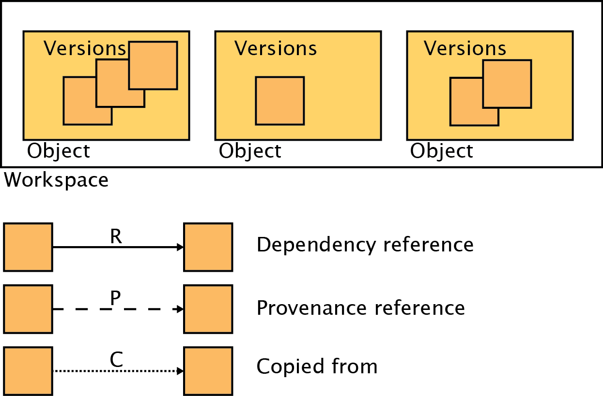
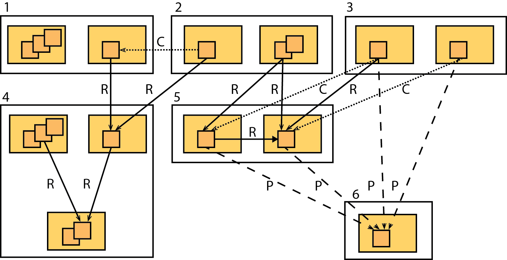

Workspace fundamentals
======================

The workspace service (WSS) provides language independent storage and retrieval
of typed objects (TOs) much like those from various object oriented programming
languages (except, of course, no behavior is associated with WSS TOs). Before
an object is stored in the WSS, it is checked against a type specification that
describes the object's structure and contents. Failing this check will abort the
storage operation.

Typed object relationships
--------------------------

TOs can be related to each other in various ways (see Figure 1):

Workspaces
^^^^^^^^^^

Workspaces are arbitrary (from the perspective of the WSS) disjoint
collections of TOs. Any meaning given to the collection is provided by the
users creating that collection. For instance, a workspace might collect TOs
representing known microbial genomes as a public resource, or, for a single
genome, reads, an assembly, a genome, and a metabolic model that represent a
single researcher's work on a microbe.

Each TOs is in one, and only one, workspace.

Workspaces may be shared with other users, allowing read, write, or
administration privileges. These privileges apply to all TOs in the workspace.

Workspaces have a user-selected name and an integer ID that is immutable and
assigned on creation. See :ref:`workspaces` for more details.

Versions
^^^^^^^^

TOs saved in the WSS are immutable. Saving 'over' a TO, rather than replacing
it, creates a new version of the object. Most of an object's properties may
differ from version to version, but the object's user-selected name, immutable
integer ID (again assigned at creation) and a few other states are the same
for all versions. See :ref:`objects` for more details.

References
^^^^^^^^^^

The WSS supports two types of references: depencency references and provenance
references.

A dependency reference is a reference that implies an object is dependent on
another object to function - a Genome on a ContigSet, for example. Dependency
references are embedded in the object itself and are called out in the type
specification (see :ref:`typedobjects`). They can thus be required, if desired,
and an object without such a dependency reference will fail to save.

In contrast, a provenance reference implies that an object was produced
from another object. These are not called out in the type specification and are
not embedded in the object.

Establishing data provenance is required for usable data and repeatable
science. Without provenance data for a data object, said object might as well
have been made from the whole cloth. Reproducing the data is impossible, and
it is impossible to judge the data's reliability.

An application or user needs the object referred to in a dependency reference
to compute on the referencing object; they do not need any provenance
references. A dependent object may or may not be part of the referring object's
provenance - for example a Genome and ContigSet could be produced at the same
time from a GenBank file and so the ContigSet would not be part of the
Genome's provenance. Rather, they would share the same provenance.

When creating an object version, dependency and provenance references can be
specified, thus recording which other objects are required to use that version
of the object, and which other objects are required to understand the creation
of that object.

Both types of references have another special property - they guarantee access
to the referent, regardless of permissions or deletion state, as long as the
user has access to the referring object. The philosophy behind this permanent
access is that a data object is useless without its provenance and dependencies
as described above.

See :ref:`objects` for more information on storing objects with references, and
:ref:`traverseobjects` for information on accessing referents.

Copies
^^^^^^

Copying a TO from another TO implies that the new TO is effectively identical
to the old TO - it possesses the same data and references. It may
not have the same name or ID or exist in the same workspace. Unlike references,
access to a copied object does not provide any special rights to the copy
source.

    Figure 1: Types of relationships between workspace service objects

Addressing workspaces and objects
---------------------------------

Workspaces may be addressed by either their mutable name or permanent ID.

Objects may be addressed by a combination of the workspace name or ID, the
object's mutable name or permanent ID, and optionally a version in the reference format 
``[workspace name or ID]/[object name or ID]/[version]``.

As an example, assume that an object with name ``MyObj``, ID 12, and 3
versions exists in a workspace with name ``MyWS`` and ID 4. The following are
all valid addresses:

====================    ===============
Address                 Targets version
====================    ===============
MyWs/MyObj              3
MyWs/12/2               2
4/MyObj                 3
4/12/1                  1
4/12/3                  3
4/12                    3
====================    ===============

The object graph
----------------

The various relationships between objects create a graph structure of nodes
(object versions) connected by edges (versions, references, and
copies). Specifically, the objects form a directed acylic graph (DAG). As
previously described, in the case of references the DAG may be traversed
without limit *in the forward direction*, e.g. from referencing object to
referent, starting with an object to which the user has direct access. A user
may also traverse the DAG in the reverse direction, but only to objects to
which the user already has direct access. See :ref:`traverseobjects` for more
details. It is possible to traverse the DAG from copy to copy source, but again
only if the copy source is directly accessible by the user.

Example
-------

Figure 2 provides an example of how an object graph might look after a few
operations.

    
    Figure 2: An example object graph

Assume that the objects in each workspace are numbered, starting at 1 in the
upper left corner and incrementing for each object as one moves along the row.
At the end of a row, the object on the next row receives the next number and
the process continues.

**Workspace #4** has three objects. Object 3 has two versions, neither of which
have outgoing references. Object 1 has 3 versions. Version 2 of object 1 has
a dependency reference to version 2 of object 3. Object 2 has one version
which has a dependency reference to version 2 of object 3.

**Workspace #1** has two objects. Object 1 has three versions, none of which have
outgoing references. Object 2 has a single version with a reference to the
single version of object 2 in workspace 4 - e.g. ``4/2/1``.

Thus, as described above, a user with access to workspace #1 also has access
to the objects addressed by ``4/2/1`` and ``4/3/2`` via object 2.

A user with access to workspace #4 has no access to object ``1/2/1`` unless
explicitly granted such by an administrator of workspace #1 (which would allow
access to all objects in workspace #1).

**Workspace #6** has a single object with a single version with no outgoing
references. Although it has four incoming references, they provide no
privileges for the referencing objects.

**Workspace #5** has two objects with one version each. Object 1 has a
provenance reference to the object in workspace #6 and a dependency reference
on object 2 in the same workspace. Object 2 has the same provenance reference
as object 1.

**Workspace #2** has two objects. Object 1 has a single version that was copied
from object ``1/2/1``. Object 2 has two versions, the first of which has
dependency references to both objects in workspace #5.

Since object 1 was copied from object ``1/2/1``, which has a dependency
reference to object ``4/2/1``, object 1 has the same reference and the same
access to workspace #4s objects as object ``1/2/1``.

If the user examining object 1 also has access to workspace #1, the information
that object 1 was copied from object ``1/2/1`` will be available. If not, the
user will know the object was copied, but not from where.

Since object 2 has two outgoing dependency references as described, access to
object 2 also provides access to objects ``5/1/1``, ``5/2/1``, and ``6/1/1``.

**Workspace #3** was cloned from workspace #5 (theoretically this should be
impossible since the workspace with the lower ID must have been created first,
but for the purposes of this example ignore that). It has the same two objects
as workspace 5, and those objects possess the same references as the objects in
workspace 5. In particular, object 1 has a dependency reference to object
``5/2/1`` (just as object ``5/1/1`` does) and both objects possess provenance
references to the object in workspace #6. Both objects also have copy
references to their source objects in workspace #5, but again, these references
provide no special privileges.
