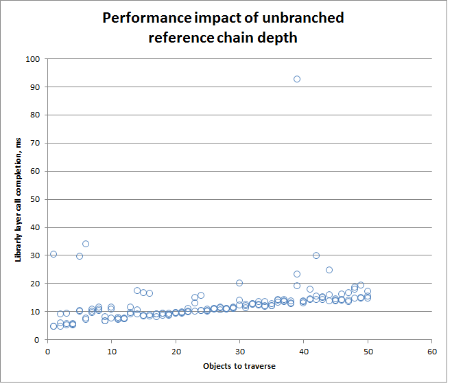
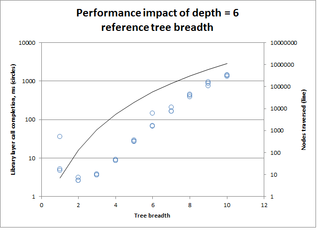
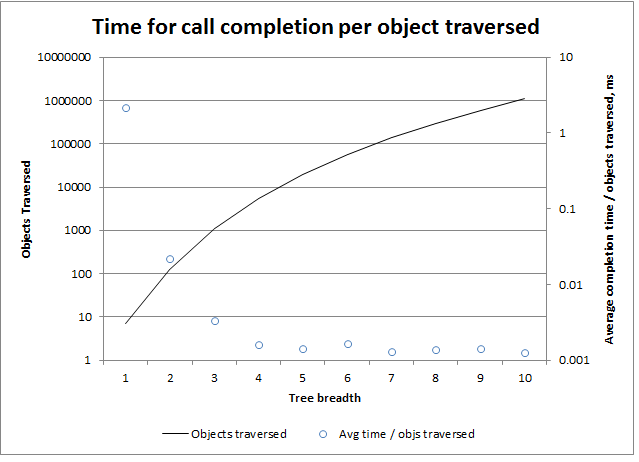

Get referenced objects without providing a reference chain
==========================================================

NOTE: This analysis was performed against the 0.3.5 version of the workspace
service on code in a development branch [here](https://github.com/mrcreosote/workspace_deluxe/compare/5d790295cf0eb0c021b92e602fd5fd155a722a7a...dev-get_refs_BFS_expt?expand=1).
It is not compatible with the current workspace service. 

The code in this branch is an experimental implementation of altering the
getObjects function to return an object to a user if that user does not have
direct access to the object, but does have access via a reference chain
from another object. Currently the user would have to provide the reference
chain to the getReferencedObject function to retrieve the object. These changes
make retrieving referenced objects much more user friendly.

The search is implemented as a referent to reference BFS (e.g. the search
proceeds in the direction **opposite** to the references) to reduce database
calls. Calls are O(search tree depth) rather than O(nodes in tree). However,
this means that the amount of data sent per call can theoretically be large.

Setup
-----
* Ubuntu VM w 20G memory, 7 virtual processors (actually supplied by 7/8ths of
  a quad core hyperthreaded chip) on laptop
* Local MongoDB 2.4.3 instance running without journaling or auth
* Tests call the Workspace library class directly, e.g. the server layer
  is bypassed
* Performance tests are in test/performance/GetReferencedObjectWithBFS

Results
-------

### Unbranched search tree

The depth of the search tree has a linear, but minor, impact on the time for
getObjects to return. This test created a linear reference chain of up to 50
objects, each of which had a single reference to the next object in the chain.
Three measurements were made per chain length.

### Branched search trees

The breadth of the search tree has a much larger effect on the getObjects
return time. The cause may simply be that the underlying database operations are
O(nodes in the search tree). This test creates branched search trees with
depth 6 where each non-leaf node in the tree has $breadth incoming references.
Three measurements were made per tree.

Note that at a breadth of 4, the search must traverse 5461 nodes, and yet is
faster than a search with breadth 1 and depth 50 which only traverses 50 nodes.
A possible explanation is that at lower node counts transport from the
workspace service to mongoDB dominates, while at higher node counts mongoDB
document reads dominate. This seems to be the case, as the call completion
time scales linearly with the tree size with trees > 5000 nodes.

Discussion
----------

Adding the code to the production server seems pretty reasonable and gives 
a large benefit in terms of useability. The test cases above are fairly
outlandish and the larger search trees are extremely unlikely to happen in
practice. Private objects are unlikely to have extremely large numbers of
references (possibly private objects like the Biochem object might), and if
they do a user will likely have a fairly short reference chain to the object.
Objects with very high number of references are likely to be public or widely
shared, increasing the chances that the user has a short reference chain to
the object.

Alternately, a cache could be added to store accessible objects and their
paths - in that case only a check that the first object in the path is still
accessible is required. The worst case is objects that are completely
inaccessible to the user - in that case the entire reference tree that
converges on the object must be searched each time in case an object in the
tree has become accessible. A very short term cache (< 10s?) might be
advisable to guard against rapid repeated requests.

Again, however, a private object with a very large search tree is unlikely.

TODOs for production
--------------------
* It's possible that an object or object(s) could have so many references
  that the server goes OOM or slows down. Should there be some sort of limit?
* Most of the get* methods should have the same behavior. Currently the code
  is only implemented for getObjects().
* The reference chain from the user accessible object to the requested object
  should be returned.
  * This necessitates saving the tree traversed in the search in server memory
    so the path can be retrieved once found.
    * To reduce memory, the tree should be pruned from
      * any node that is inaccessible and has no references
      * any node that already exists in the tree on an attempted insert
        * the path is guaranteed to be equivalent or shorter from the
          existing node.
        * If multiple objects are requested simultaneously, they should have
          independent trees, even if the trees share nodes.
      * Keep track of tree memory usage. If too high, GC them and return an
        error note with the object data rather than the path.
    * Delete the tree once paths are determined, prior to pulling objects from
      the backend.
* Make the option available in the type compiled API.
* Lots and lots of tests.
* Possibly a cache, but this seems unnecessary as a 50k node tree search
  returns in < 100ms. A short term (< 10s) cache of unaccessible objects might
  be advisable to guard against repeated requests. Placing a reasonable limit
  (50K?) on the search tree size seems to be an acceptable solution.
